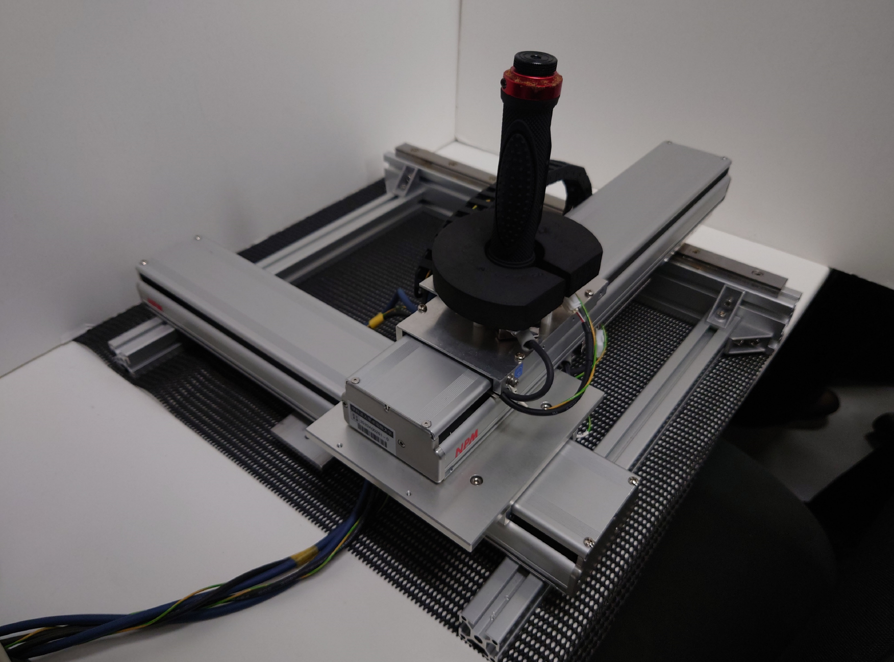
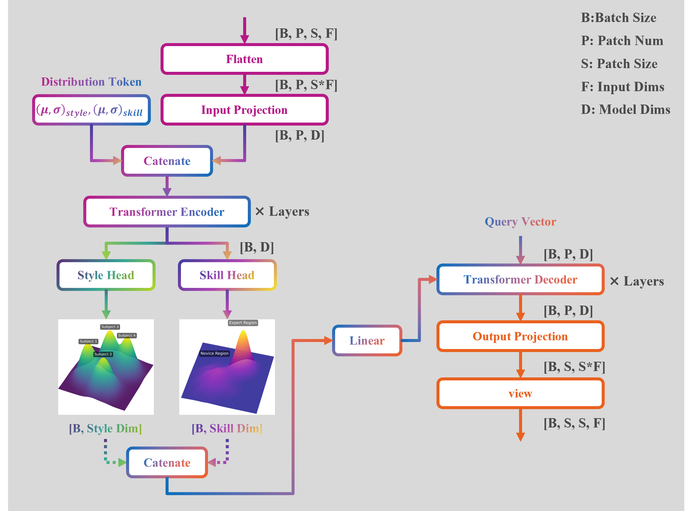
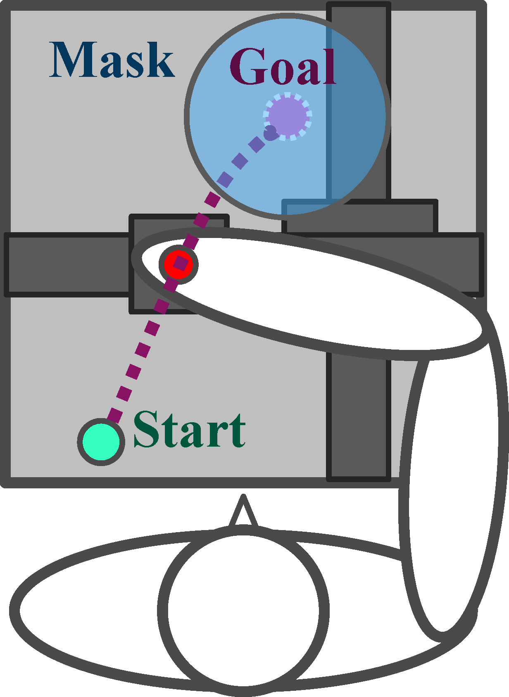
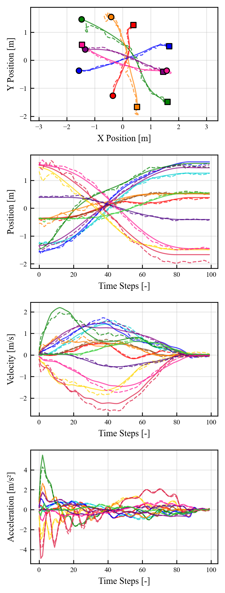
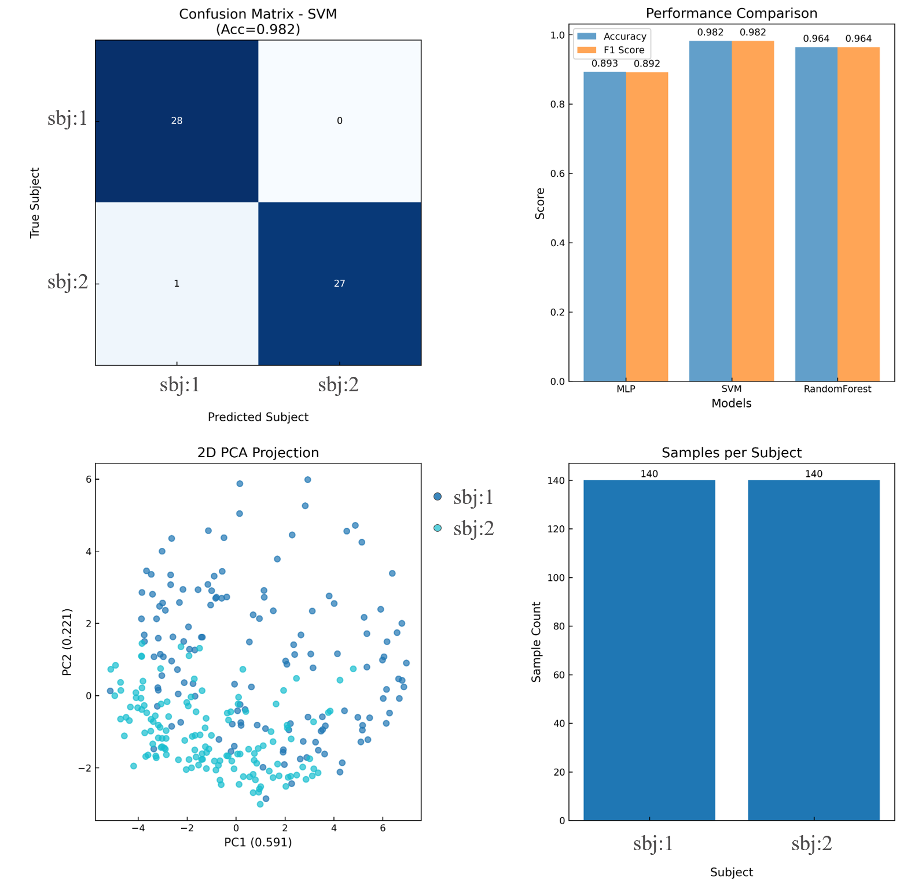
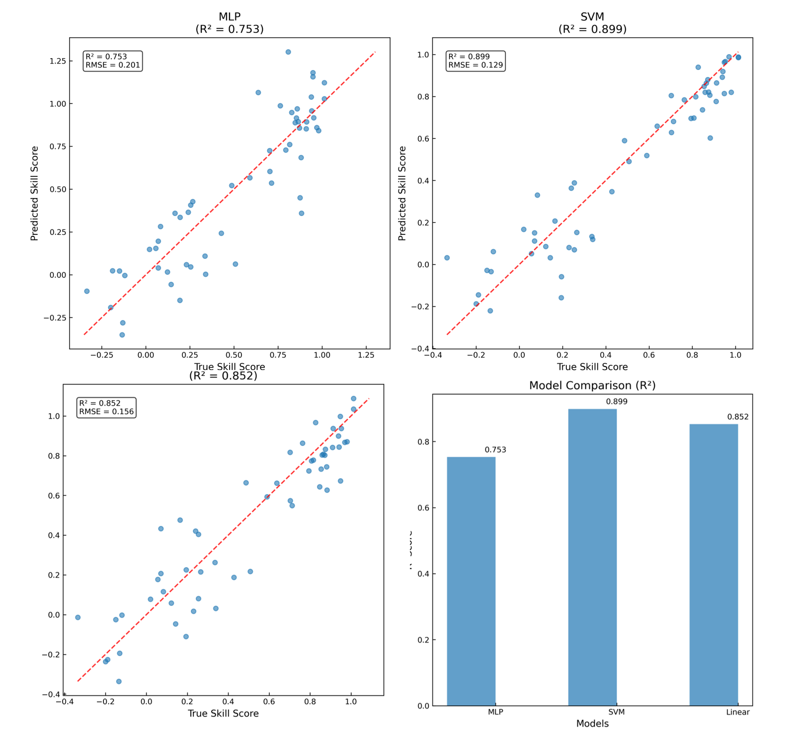
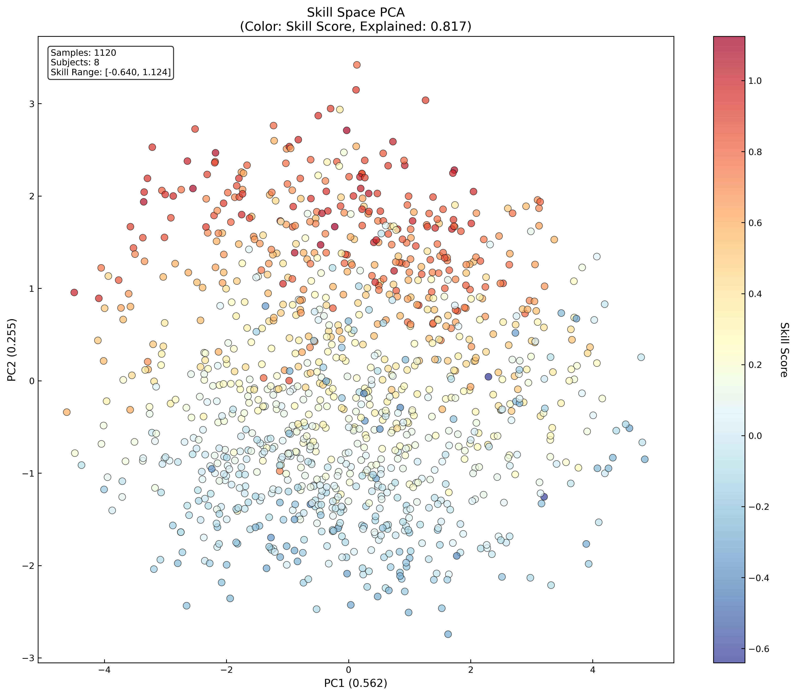

<h1 align="center">Skill-Style Disentanglement：運動技能支援のためのスキル・スタイル分離モデルの構築</h1>

<p align="center">
  個人最適な運動学習のための、スタイルとスキルを分離するモデルを提案します。TransformerをベースとしたVAEであり、運動データをスキル空間とスタイル空間に射影し、独立に操作した運動データを生成するモデルです。
</p>

<p align="center">
  <a href="https://www.python.org/">
    
  </a>
  <a href="https://pytorch.org/">
  
  </a>
  <a href="https://www.sqlite.org/index.html">
    
  </a>
  <a href="https://plotly.com/">
    
  </a>
</p>

---

## 📚 目次 (Table of Contents)

- 📝 概要
- 🎯 研究背景と目的
- ⚙️ システム構成
- 🛠️ 使用技術
- 📈 成果
- 🔭 今後の展望

---

## 📝 概要 (Overview)

本リポジトリは、画一的な指導から脱却し、個々人に最適化されたお手本生成を通して、個人最適な熟達支援を実現するための研究プロジェクトです。

核となるのは、人間の複雑な運動データを「スキル（技能）」と「スタイル（個分の癖）」という独立した要因に分離する、独自のTransformer-VAEモデルです。

この生成モデルを用いた、スタイルとスキルを任意に操作した動作データを生成し、力覚フィードバックが可能な自作の実験デバイスを用いて被験者にフィードバックします。
これにより、「個人の癖を活かしたまま、技能の核心部分だけを向上させる」という、従来にない物理的フィードバックを生成・提示します。

---

## 🎯 研究背景と目的 (Background and Objectives)

- 従来の課題： 従来の運動支援は、画一的な理想フォームを目指すものが多く、個人の身体特性や「癖（スタイル）」を活かした指導が困難でした。

- 本研究の目的： 動作データから「スキル」と「スタイル」をVAEで分離し、スタイルを維持したままスキル情報のみを操作・支援することで、個人に最適化された運動技能支援を実現します。

---
## ⚙️ システム構成 (System Architecture)
### ハードウェア（実験装置）
- デバイス：直交二軸リニアアクチュエータ 

    <p align="center">
        
    </p>
    

- 特徴
  - ハンドル操作による2次元の運動データ（位置、速度、加速度）を測定
  - Admittance制御により任意の仮想ダイナミクスを提示可能
  - 生成モデルが生成した支援情報を力覚フィードバックとして操作者にリアルタイムで物理提示

### ソフトウェア（提案モデル）
- アーキテクチャ

<p align="center">
  
</p>


  モデルのコードは[こちら](src/PredictiveLatentSpaceNavigationModel/TransformerBaseEndToEndVAE/models/Tokenize/patched_token_pool_compressed_style_skill_separation_net.py)にございます。
  - エンコーダが動作データをスキル潜在空間とスタイル潜在空間に射影
  - 各空間に個別の損失関数を適用することで意味的な分離を実現
- 損失関数
  - 再構築誤差
    ```math
    \mathcal{L}_{\text{rec}} = \frac{1}{\sum M} \sum_{i} M_i (\hat{x}_i - x_i)^2
    ```
  - KL損失
    ```math
    \mathcal{L}_{\text{KL,style}} = D_{KL}(q(z_{\text{style}}|x) \parallel p(z_{\text{style}}))
    ```
    ```math
    \mathcal{L}_{\text{KL,skill}} = D_{KL}(q(z_{\text{skill}}|x) \parallel p(z_{\text{skill}}))
    ```
  - 直行性損失
    ```math
    \mathcal{L}_{\text{orth}} = \frac{1}{Sty \cdot Ski} \sum_{j=1}^{Sty} \sum_{k=1}^{Ski} (C_{j,k})^2
    \quad \text{where} \quad
    C = \frac{1}{B} \bar{Z}_{\text{style}}^T \bar{Z}_{\text{skill}}
    ```
  - スキル因子損失
    ```math
    \mathcal{L}_{\text{factor}} = \mathbb{E} [ \| \hat{y} - y \|^2_2 ]
    \quad \text{where} \quad
    \hat{y} = f_{\text{reg}}(z_{\text{skill}})
    ```
  - 統合損失
    ```math
    \mathcal{L}_{\text{total}} = \mathcal{L}_{\text{rec}} + \beta_{\text{style}} \mathcal{L}_{\text{KL,style}} + \beta_{\text{skill}} \mathcal{L}_{\text{KL,skill}} + \gamma_{\text{orth}} \mathcal{L}_{\text{orth}} + \gamma_{\text{factor}} \mathcal{L}_{\text{factor}}
    ```

---
## 🔬 実験（Experiment）
    
<p align="center">
    
</p>

### 実験の概要
- 本実験はフィードフォワード要素の強い動作を測定するために平面上のPoint to Point動作を対象とした
- リニアアクチュエータのハンドルとタスク画面上のAgentの位置は同期しており、被験者はハンドルをゴールまで動かした
- 毎回の試行でスタートとゴールはランダムに提示され、ハンドルがゴール付近に近づくとゴールがMaskされ、フィードバックによる修正を不可能にした
- 試行終了時にはMaskが解除され、誤差とその方向が視覚的に提示された
- 被験者は35回の試行毎に最低30 sec以上の休憩が設けられた
- 35回毎のまとまりをブロックと呼び、合計4ブロック分、合計140試行分の動作データが測定された

### 実験の条件
- 本実験は健常な運動機能を持つ20代の男性9人について行われた
- 利き手でタスクを行い、なるべく素早くハンドルを動かすように指示された
- 試行毎の動作データはハンドルの位置、速度、加速度をモータ制御部で10 kHzで測定、計算した後、実験データ収集用のプログラムにて100 Hzで記録された

---

### データセット構築
本モデルの学習用データセットは以下の4つの処理を経て計算された。

1. スキル指標の計算
    
    全試行の動作データから、終点誤差、動作時間、ジャーク、軌道曲率など8種類のスキル指標を計算した。
2. 熟達者モデルによる因子分析

    学習の最終段階であるブロック4のデータを熟達した動作と定義し、このデータのみで因子分析を実行し、その背後にある共通因子を特定し、このモデルを以降のスキルスコアの算出に用いた。
3. スキルスコアの算出
    
    全データ（ブロック1~4）を熟達者モデルに入力し、各試行の因子スコアを計算し、各因子の因子寄与率で重み付けを行い、単一のスキルスコアを算出した。
4. 正規化

    軌道データ毎に因子スコアとスキルスコアを結合し、これを被験者ごとに訓練、検証データに分割し、訓練データの統計量を用いて全データを正規化したものをデータセットとした。

### データセット構築の詳細

### 1. スキル指標の計算

全試行データから、巧拙や特徴を表す以下の8つの運動スキル指標を計算した。

- 終点誤差 $m_{error}$ ：最終到達点と目標点 $P_{target}$ とのユークリッド距離
    ```math
    m_{\text{error}} = \| \mathbf{p}_{\text{final}} - \mathbf{p}_{\text{target}} \|_2
    ```
- 動作時間 $m_{time}$ ：試行開始から終了までの時間
    ```math
    m_{\text{time}} = T_{\text{end}} - T_{\text{start}}
    ```
- ジャーク $m_{jerk}$ ：加速度 $a(t)$ の時間微分の平均絶対値
    ```math
    m_{\text{jerk}} = \mathbb{E} [ \| \mathbf{j}(t) \| ] = \mathbb{E} \left[ \left\| \frac{d\mathbf{a}(t)}{dt} \right\| \right]
    ```
- 速度滑らかさ $m_{vel\_smooth}$ ：速度 $|v(t)|$ 変動の標準偏差の逆数
    ```math
    m_{\text{vel\_smooth}} = \frac{1}{1 + \sigma(\Delta|v(t)|)}
    ```
- 加速度滑らかさ $m_{acc\_smooth}$ ：加速度 $|a(t)|$ 変動の標準偏差の逆数
    ```math
    m_{\text{acc\_smooth}} = \frac{1}{1 + \sigma(\Delta|a(t)|)}
    ```
- 制御安定性 $m_{stability}$ ：加速度 $|a(t)|$ の標準偏差の逆数
    ```math
    m_{\text{stability}} = \frac{1}{1 + \sigma(|a(t)|)}
    ```
- 軌道曲率 $m_{curve}$ ：軌跡の曲率の平均。3点 $P_1, P_2, P_3$ からManger曲率 $\kappa$ として計算
    ```math
    \kappa = \frac{4 \cdot \text{Area}(\mathbf{p}_1, \mathbf{p}_2, \mathbf{p}_3)}{\| \mathbf{p}_1 - \mathbf{p}_2 \| \| \mathbf{p}_2 - \mathbf{p}_3 \| \| \mathbf{p}_3 - \mathbf{p}_1 \|}
    ```

### 2. 熟達者モデルによる因子分析

本研究では、学習の最終段階であるBlock 4のデータを熟達した動作と定義し、以下の流れで動作データを因子分析した。

1. データ抽出：Block 4のスキル指標データ $M_{B4}$ のみを使用
2. $\mathbf{M}_{B4}$ を標準化し、 $\mathbf{Z}_{B4}$ を得る。このときのスケーラ $S_{B4}$ を熟達者スケーラとして保存した。
3. 標準化されたデータ $\mathbf{Z}_{B4}$ に対し、因子分析を実行した。これにより8つのスキル指標の背後にある $f$ 個の共通因子を特定した。

    ここで $\mathbf{L}$ は因子負荷量行列であり、分析モデル $FA_{B4}$ を熟達者因子分析モデルとした。
    ```math
    \mathbf{z} = L \mathbf{f} + \mathbf{\epsilon}
    ```

### 3. スキルスコアの算出

次に、全ブロックのデータ $\mathbf{M}_{all}$ に対して、熟達者因子分析モデルを用いてスキルスコアを算出した。

1. 全ての試行 $i$ のスキル指標 $m_i$ を、熟達者スケーラ $S_{B4}$ で標準化した。
    ```math
    \mathbf{z}_i = S_{\text{B4}}(\mathbf{m}_i)
    ```

2. 標準化された $\mathbf{z}_i$ を熟達者因子分析モデル $FA_{B4}$ に入力し、各試行の $k$ 次元の因子スコア $\mathbf{f}_i=[\mathbf{f}_{i,1},...,\mathbf{f}_{i,k}]$ を計算した。

3. 各因子スコア $\mathbf{f}_{i,j}$ を、その因子の寄与率 $\mathbf{w}_j$ で重み付け加算し、総合的な巧拙を表す単一のスキルスコア $S_i$ を算出した。
    ```math
    S_i = \sum_{j=1}^{k} w_j \cdot f_{i,j}
    ```

### 4. 正規化

1. 元の動作データ $\mathbf{X}_{traj}$ と、ステップ3で計算した因子スコア $\mathbf{f}$ 及びスキルスコアを試行毎に結合した。
2. 被験者IDに基づき、データセットを訓練用 $D_{train}$ と検証用 $D_{test}$ に分割した。
3. 訓練用データ $D_{train}$ の統計量のみを用いて動作データとスキル因子、スキルスコアを正規化し、データセットとした。


---

## 📈 成果 (Results)
提案モデルの有効性を入力データに対する再構築誤差、スタイル潜在変数による被験者分類、スタイル潜在空間の定性的評価、スキル潜在変数によるスキル因子回帰、スキル潜在空間の定性的評価で評価した。
以下にそれぞれの評価結果を示す。
- 入力データに対する再構築誤差
  - 元データと再構築軌道のプロット(上から位置２次元、位置、速度、加速度)
    
    モデルの生成性能を定性的に評価する。
  
    入力データに対して、高周波のノイズが重畳したようなデータが確認できるが、軌道の概形は捉えられていることがわかる。
  
    <p align="center">
        
    </p>
    
  - 位置、速度、加速度のRMSE
    
    モデルの生成性能を定量的に評価する。
    
    位置、速度、加速度において同一スケールの誤差が確認できるが、全体的なRMSEは0.1程度に留まっており、モデルが軌道の主要な運動学的特徴を再構築できていることが定量的に示された。

    <div align="center">
        <table>
          <thead>
            <tr>
              <th>Metric</th>
              <th>X-Component</th>
              <th>Y-Component</th>
              <th>Overall</th>
            </tr>
          </thead>
          <tbody>
            <tr>
              <td>Position [m]</td>
              <td>0.098</td>
              <td>0.094</td>
              <td>0.096</td>
            </tr>
            <tr>
              <td>Velocity [m/s]</td>
              <td>0.113 </td>
              <td>0.106</td>
              <td>0.110</td>
            </tr>
            <tr>
              <td>Acceleration[m/s^2]</td>
              <td>0.130</td>
              <td>0.132</td>
              <td>0.131</td>
            </tr>
          </tbody>
        </table>
    </div>

- スタイル空間評価
  - スタイル変数から被験者の分類精度の評価

    被験者固有の筋骨格構造や認知特性に由来するスタイルをモデルが分離できているかを評価する。
  
    動作データからエンコードされたスタイル潜在変数を単純な分類器であるMLP、SVM、RandomForestに学習データとして与え、被験者分類が実現されるかを確認した。
    
    結果から90%以上の精度でどの分類器でも被験者分類ができていることがわかる。また、スタイル潜在空間を主成分分析：PCAで可視化したプロットを見ると潜在空間上で異なる領域にそれぞれの被験者の動作データが射影されていることが確認できる。
  
    以上から、本モデルはスタイル空間の構造化を促す損失関数を用いていないのにもかかわらず、モデルが自然にスタイル情報をエンコードしたことが示唆された。
    
    <p align="center">
        
    </p>


- スキル空間評価
  - スキル潜在変数によるスキル因子回帰精度
  
    被験者の巧拙を表すスキル情報をモデルが分離できているかを評価する。
    
    動作データからエンコードされたスキル潜在変数を単純な回帰モデルであるMLP、SVM、線形回帰モデルに学習データとして与え、被験者のスキルスコアが回帰できるかを確認した。
  
    結果からどのモデルでも0.75以上の決定係数であることがわかった。
    
    以上から、本モデルは被験者の運動データから巧拙を表すスキルの表現を獲得していることが示唆された。

    <p align="center">
        
    </p>
    
  - スキル潜在空間の定性的評価
    
    スキル潜在空間をPCAで可視化し、スキル空間に熟達者のデータが集まるような領域が形成されているかを確認した。
  
    これは個人最適なお手本生成を行うための重要な前提条件であり、熟達者が集まる領域が確認されれば、学習者の運動データを測定した後、
    潜在空間に射影し、スタイル潜在変数を固定しながらスキル潜在変数を熟達者が集まる領域に段階的に移動させながら動作データのサンプリングを行い、
    学習者にフィードバックを行えば、学習者には常に学習者自身のスタイルが反映された少しだけ熟達した動作データが提示されることになり、効率的な運動学習が実現されることが期待される。
    
    結果から主成分2が増加するに応じて熟達度を表すスキルスコアが増加していることがわかる。このことからモデルはスキル因子を回帰する過程でスキル空間をスキルスコアが連続的に変化するように構造化したことがわかる。
  
    以上から、本モデルは個人最適なお手本生成が可能な潜在空間の構造を有していることが示された。一方で、動作データの生成精度には課題が残っている。今後は、エンコーダの重みを固定し、デコーダをより表現力を持つ拡散モデルに切り替えることで再構成誤差の低減に努めていく。

    <p align="center">
        
    </p>    

---
## 🔭 今後の展望 (Future Work)
- スキル変換の実現
- 全身のボーンデータへのモデル適用
- 強化学習を用いたインタラクティブにスキル空間を探索して、支援するエージェントの開発

---
## 🛠️ 使用技術 (Methods)

<div align="center">
    <table>
      <thead>
        <tr>
          <th>Category</th>
          <th>Technology Stack</th>
        </tr>
      </thead>
      <tbody>
        <tr>
          <td>Model Development</td>
          <td>PyTorch</td>
        </tr>
        <tr>
          <td>Data Analysis</td>
          <td>Pandas, schikit-learn</td>
        </tr>
        <tr>
          <td>Device Control</td>
          <td>C++, Ether CAT</td>
        </tr>
        <tr>
          <td>Environment Setup</td>
          <td>Docker</td>
        </tr>
        <tr>
          <td>Database</td>
          <td>SQLite</td>
        </tr>
        <tr>
          <td>Visualization</td>
          <td>Plotly, Matplot</td>
        </tr>
      </tbody>
    </table>
</div>
